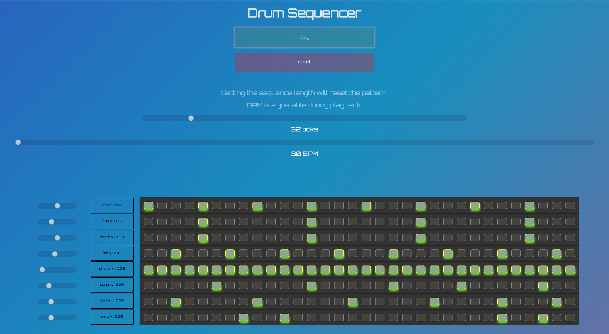

# <center>Drum Sequencer</center> 



 [https://drumsequencer.jasonbelcher.dev](https://drumsequencer.jasonbelcher.dev/)


written with Vanilla.js & Howler.js

## <center>Install Instructions</center>

```
git clone git@github.com:JasonBBelcher/drum-machine.git

npm i

// starts browser-sync for development
npm run start:dev

// starts prod http-server

npm start

```


