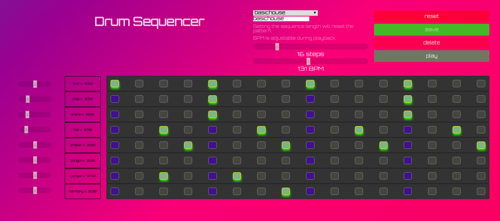
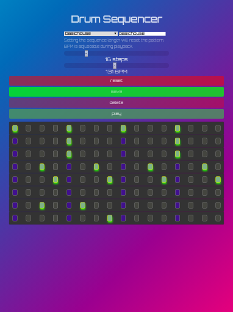
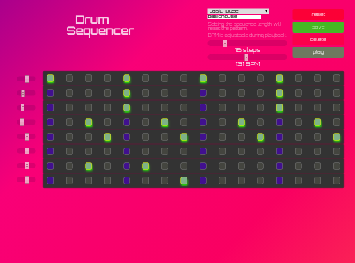
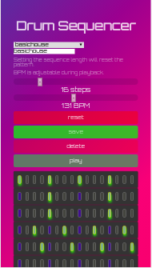

# <center>Drum Sequencer</center>

### laptop view



### ipad portrait view



### ipad landscape view



### mobile portrait view



[https://drumsequencer.jasonbelcher.dev](https://drumsequencer.jasonbelcher.dev/)

### Libraries & Tools

- [flexbox grid](http://flexboxgrid.com/) 12 column grid for flex box
- [Howler](https://howlerjs.com/) web based sound player
- [parceljs](https://parceljs.org/) zero configuration web application bundler

#### Audio Browser Support

- Google - fair
- Edge - fair
- Firefox - bad :(

## <center>Install Instructions</center>

```
git clone git@github.com:JasonBBelcher/drum-machine.git

npm i

// starts parcel dev server for development
npm run start:dev

// builds parcel bundle

npm run prod:build

// starts production server

npm start

```

### Notes on the Challenge

Performance varies depending on the browser. Stuttering and shaky tempo can be heard due to setInterval not being as accurate as I once thought. The amount of jitter is absolutely unacceptable in firefox and I had no idea how bad till later. In hindsight I would have found a better solution. This project is my first foray into audio in the browser.

Regardless of the difficulties with setInterval I accomplished my goal of making a drum sequencer without the help of any framework such as React, Angular, or Vue. Web audio is a deep subject and I'm sure I'll be learning more about it for a long time to come.

My next iteration will be done with the [webaudio api](https://developer.mozilla.org/en-US/docs/Web/API/Web_Audio_API) or [Tone.js](https://tonejs.github.io/). Until I have the time to embark in another adventure in web based audio projects this one will have to do.
